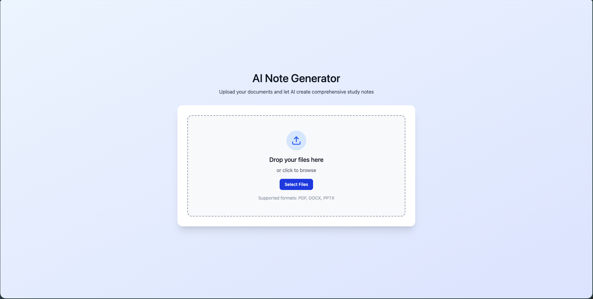
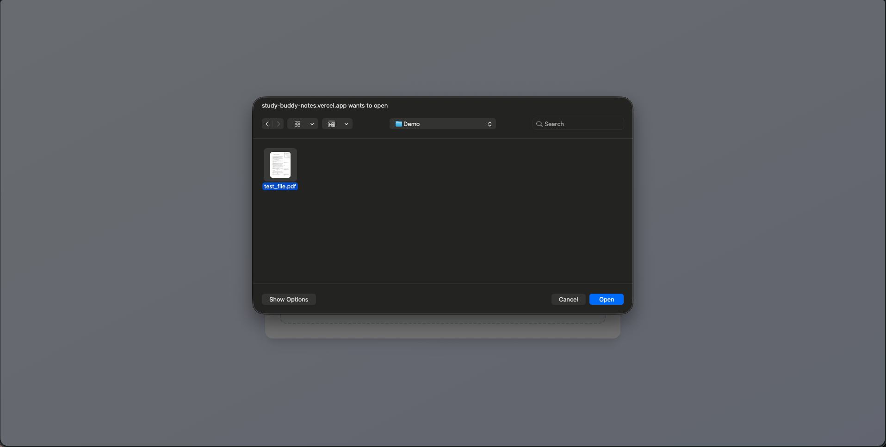
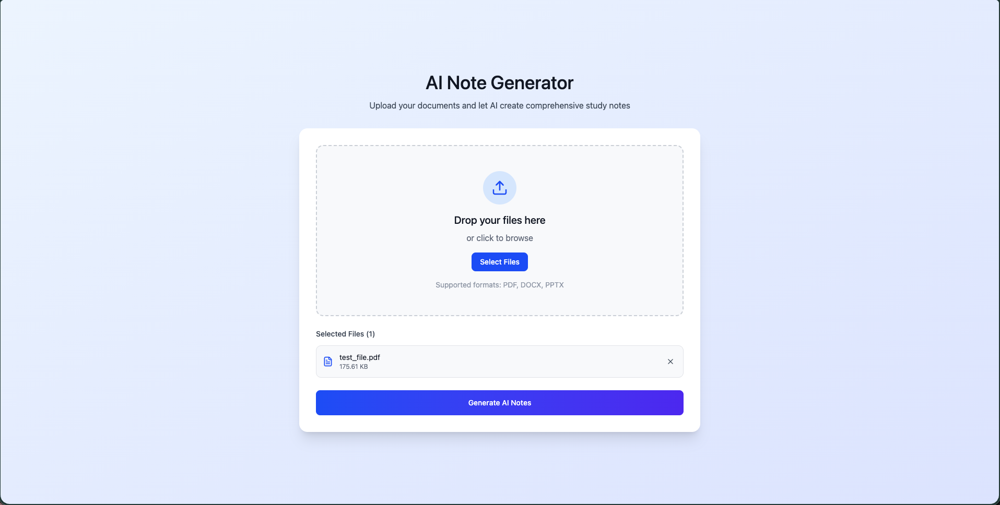
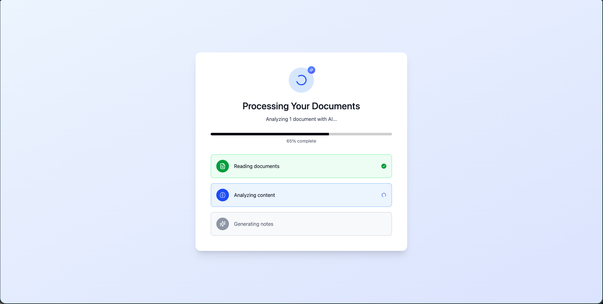
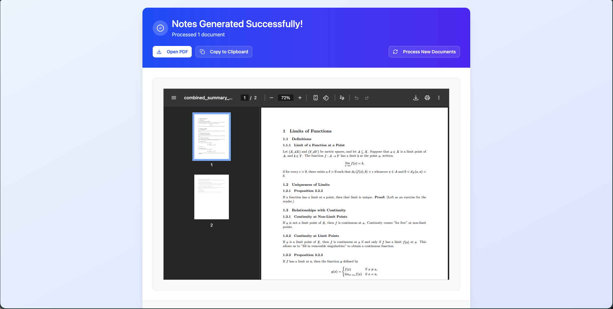
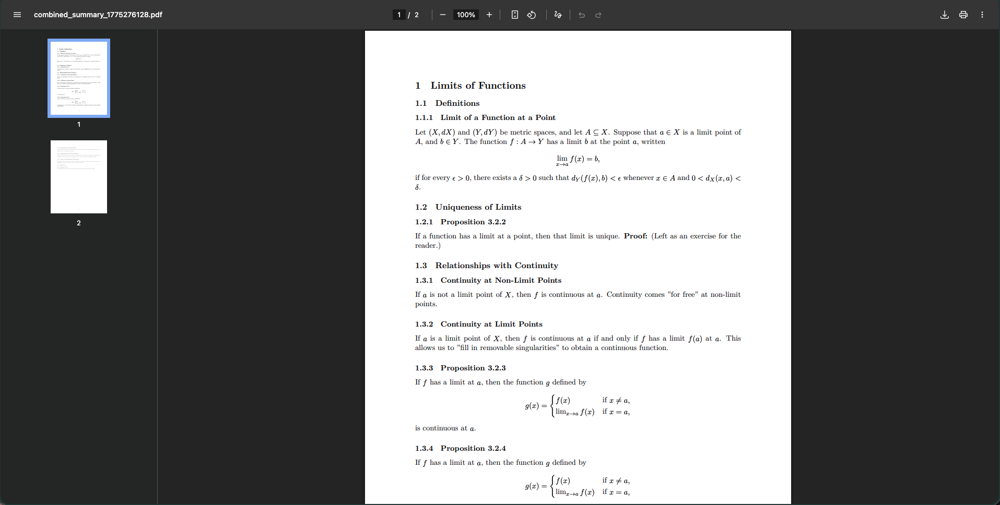

<h1 align="center">Study Buddy!</h1>

Study Buddy allows users to generate concise notes from PDF, DOCX, and PPTX files using artificial intelligence. 

Try the app here:
[study-buddy-notes.vercel.app](https://study-buddy-notes.vercel.app/)

## Usage and Demo
1. On the welcome page, click on the "Select Files" button to begin.

2. Select relevant files in PDF, DOCX, or PPTX, up to 10 MB total.

3. Once all desired files are selected, click on the "Generate AI Notes" button.

4. Wait for file processing and note generation to complete.

5. Notes are generated! View the notes using the in-app PDF viewer. Click the "Copy to Clipboard" button to copy the note's as raw LaTeX. Once finished, click the "Process New Documents" button to return to the initial file upload page.

6. Alternatively, click the "Open PDF" button to open the PDF in a new tab, from where the notes can be downloaded.

## Tech Stack
Frontend: 
- React
- TypeScript

Backend: 
- Node.js / Express
- Python

Infrastructure: 
- Docker
